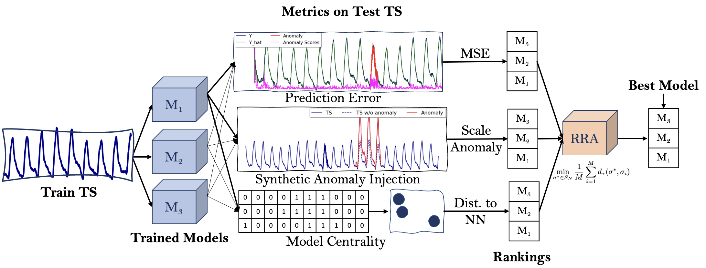

<h1 align="center">Unsupervised Model Selection for Time-series Anomaly Detection</h1>
<h3 align="center">Most time-series anomaly detection models don't need labels for training. So why should we need labels to select good models? </h3>

<p align="center">
    
    
</p>

<p align="center">
TL;DR: We introduce `tsadams` for unsupervised <b>t</b>ime-<b>s</b>eries <b>a</b>nomaly <b>d</b>etection <b>m</b>odel <b>s</b>election!
</p>

Hundreds of models for anomaly detection in time-series are available to practitioners, but no method exists to select the best model and its hyperparameters for a given dataset when labels are not available. We construct three classes of surrogate metrics which we show to be correlated with common supervised anomaly detection accuracy metrics such as the F1 score. The three classes of metrics are prediction accuracy, centrality, and performance on injected synthetic anomalies. We show that some of the surrogate metrics are useful for unsupervised model selection but not sufficient by themselves. To this end, we treat metric combinations as a rank aggregation problem and propose a robust rank aggregation approach. Large scale experiments on multiple real-world datasets demonstrate that our proposed unsupervised aggregation approach is as effective as selecting the best model based on collecting anomaly labels.

<p align="center">

</p>

Figure 1: *The Model Selection Workflow.* We identify three classes of surrogate metrics of model quality, and propose a novel robust rank aggregation framework to combine multiple rankings from metrics. 

If you use this code, please consider citing our work: 
> [Unsupervised Model Selection for Time-series Anomaly Detection](https://openreview.net/pdf?id=gOZ_pKANaPW)\
Mononito Goswami, Cristian Ignacio Challu, Laurent Callot, Lenon Minorics, Andrey Kan\
International Conference on Learning Representations (ICLR), 2023\
arXiv:2210.01078v3

----

## Contents

1. [Datasets](#datasets)
2. [Installation](#installation)
3. [Citation](#citation)


<a id="datasets"></a>
## Datasets

We carry out experiments on two popular and widely used real-world collections with diverse time-series and anomalies: (1) UCR Anomaly Archive (UCR) (Wu & Keogh, 2021), and (2) Server Machine Dataset (SMD) (Su et al., 2019). 

These datasets can be downloaded using the `download_data.py` script in the `scripts` directory and loaded using the `tsadams.datasets.load.load_data(...)` function. 

To load the UCR dataset: 

```python  
    from tsadams.datasets.load import load_data

    # Load the data
    ENTITY = 'anomaly_archive' # 'anomaly_archive' OR 'smd' 
    
    DATASET = '028_UCR_Anomaly_DISTORTEDInternalBleeding17' # Name of timeseries in UCR or machine in SMD
    
    train_data = load_data(dataset=DATASET, 
                           group='train', 
                           entities=[ENTITY], 
                           downsampling=None, 
                           root_dir='/path_to_dataset_dir', 
                           normalize=True, 
                           verbose=True)
    
    test_data = load_data(dataset=DATASET, 
                          group='test', 
                          entities=[ENTITY], 
                          downsampling=None, 
                          root_dir='/path_to_dataset_dir', 
                          normalize=True, 
                          verbose=True)

```

----

<a id="installation"></a>
## Installation

We recommend installing [Ananconda](https://conda.io/projects/conda/en/latest/index.html) to run our code. To install Anaconda, review the installation instructions [here](https://docs.anaconda.com/anaconda/install/). 

To setup the environment using [`conda`](https://conda.io/projects/conda/en/latest/index.html) (recommended, but optional), run the following commands:

```console
    # To create environment from environment_explicit.yml file
    foo@bar:~$ conda env create -f environment_explicit.yml
    
    # To activate the environment
    foo@bar:~$ conda activate modelselect 
    
    # To verify if the new environment was installed correctly
    foo@bar:~$ conda env list 

```

For an editable installation of our code from source, run the following commands:

```console

    foo@bar:~$ git clone https://github.com/mononitogoswami/tsad-model-selection.git
    foo@bar:~$ cd tsad-model-selection/src/
    foo@bar:~$ pip install -e .

```

----
<a id="citation"></a>
## Citation

If you use our code please cite our paper: 

```bibtex

    @article{
        goswami2023unsupervised,
        title={Unsupervised Model Selection for Time-series Anomaly Detection},
        author={Goswami, Mononito and Challu, Cristian and Callot, Laurent and Minorics, Lenon and Kan, Andrey},
        journal={International Conference on Learning Representations.},
        year={2023},
    }

```
